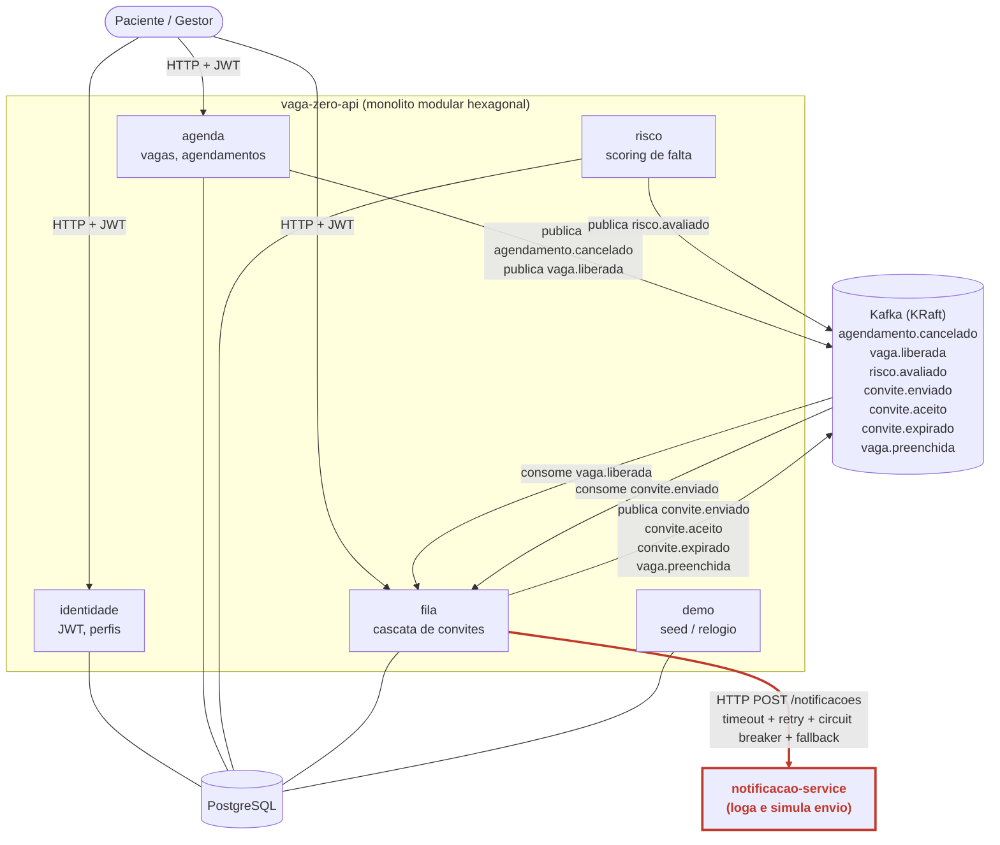
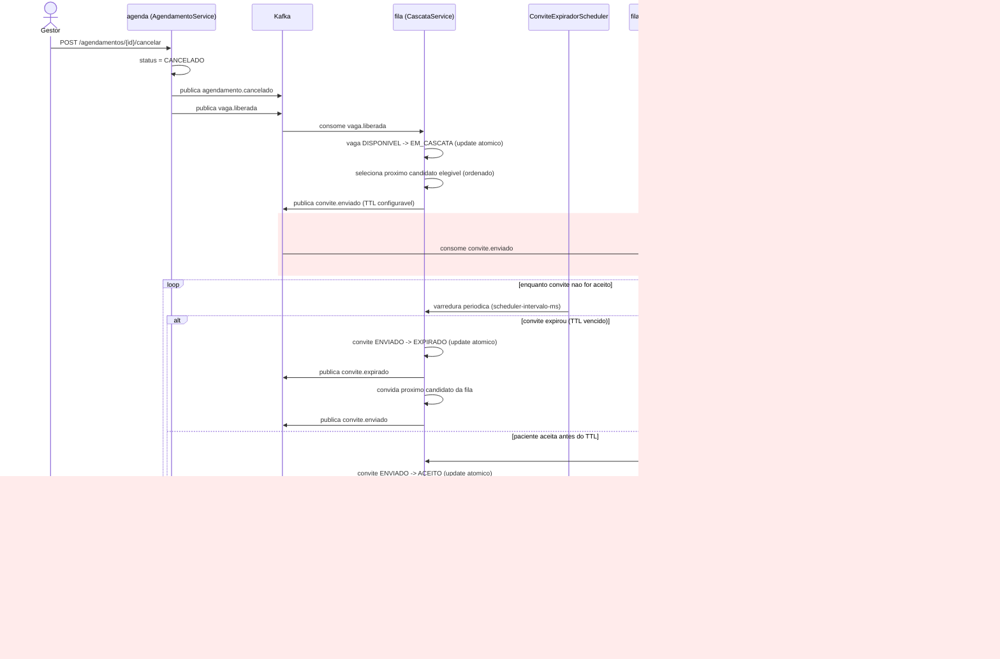
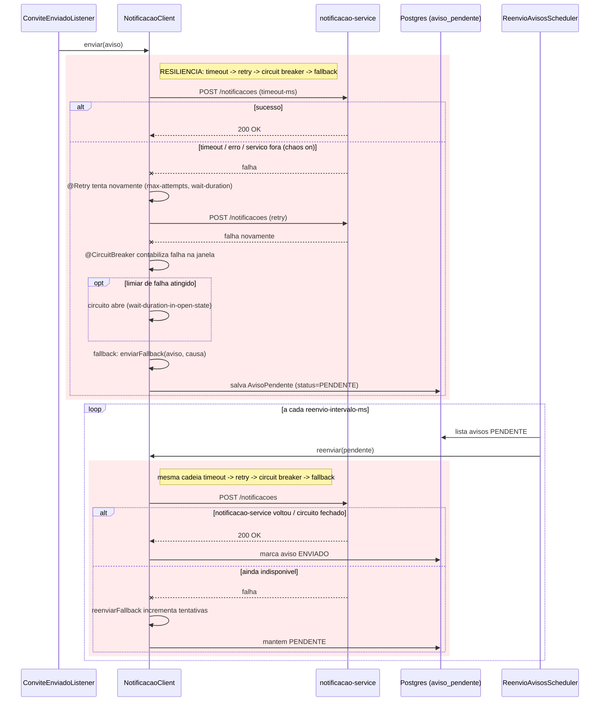

# Arquitetura — Vaga Zero

Diagramas fiéis à implementação atual do repositório (módulos, tópicos Kafka,
listeners e proteção de resiliência realmente existentes no código). Gerados
para o relatório e para a gravação do vídeo — priorizam clareza sobre
completude.

## 1. Componentes

Dois deployables: `vaga-zero-api` (monólito modular hexagonal, módulos
`identidade`, `agenda`, `risco`, `fila`, `demo`) e `notificacao-service`
(serviço separado, minimalista, só loga). `vaga-zero-api` persiste em
Postgres, publica e consome eventos em Kafka, e chama `notificacao-service`
via HTTP — essa chamada é o ponto de resiliência do projeto (timeout → retry
→ circuit breaker → fallback), destacado em vermelho. Os tópicos Kafka
`agendamento.cancelado`, `risco.avaliado`, `convite.aceito` e
`vaga.preenchida` são publicados para auditoria/observabilidade, mas hoje não
têm consumidor Java no repositório — só `vaga.liberada` (consumida pelo
módulo `fila` para iniciar a cascata) e `convite.enviado` (consumida para
disparar a notificação) têm `@KafkaListener`.

## 2. Sequência — cascata de convites (cancelamento até aceite)

Do cancelamento do agendamento até a ocupação da vaga. `AgendamentoService`
publica `agendamento.cancelado` e, na sequência, `vaga.liberada` — este
último é o gatilho consumido por `VagaLiberadaListener`, que aciona
`CascataService.iniciarCascata`. A transição de status da vaga
(`DISPONIVEL → EM_CASCATA`) e do convite (`ENVIADO → ACEITO`/`EXPIRADO`) usa
sempre um `UPDATE` atômico condicional, o que torna o consumo idempotente
mesmo com a semântica *at-least-once* do Kafka — por isso uma entrega
duplicada de `vaga.liberada` não abre uma segunda cascata. O envio da
notificação (destacado) roda em um listener separado (`convite.enviado`),
propositalmente desacoplado do motor da cascata: uma falha ali nunca
compromete a criação do convite, que já está persistido antes do listener
rodar.

## 3. Sequência — resiliência na chamada ao notificacao-service

Toda chamada de `vaga-zero-api` a `notificacao-service` passa por
`NotificacaoClient`, protegido nesta ordem: **timeout** (connect/read
configurados no `RestClient`) → **retry** (`@Retry`, `max-attempts` +
`wait-duration`) → **circuit breaker** (`@CircuitBreaker`, janela contada por
chamadas) → **fallback** (`enviarFallback`). O `@Retry` envolve o
`@CircuitBreaker` (ordem configurada em `resilience4j.retry.retry-aspect-order`
/ `circuitbreaker.circuit-breaker-aspect-order`), então cada tentativa é
individualmente contabilizada pelo circuito. O fallback nunca perde o
convite — ele já está persistido como `ENVIADO` antes desta chamada — apenas
grava um `AvisoPendente` em Postgres para reenvio. `ReenvioAvisosScheduler`
varre os avisos pendentes periodicamente e chama `NotificacaoClient.reenviar`,
protegido pela mesma cadeia; quando o serviço volta (ou o circuito fecha), o
reenvio marca o aviso como `ENVIADO` sem intervenção manual.

